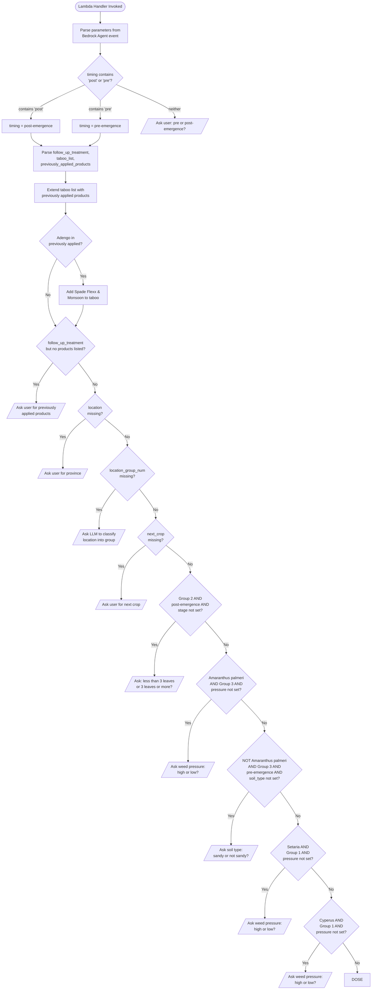
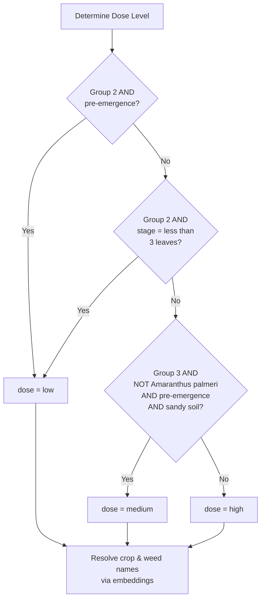
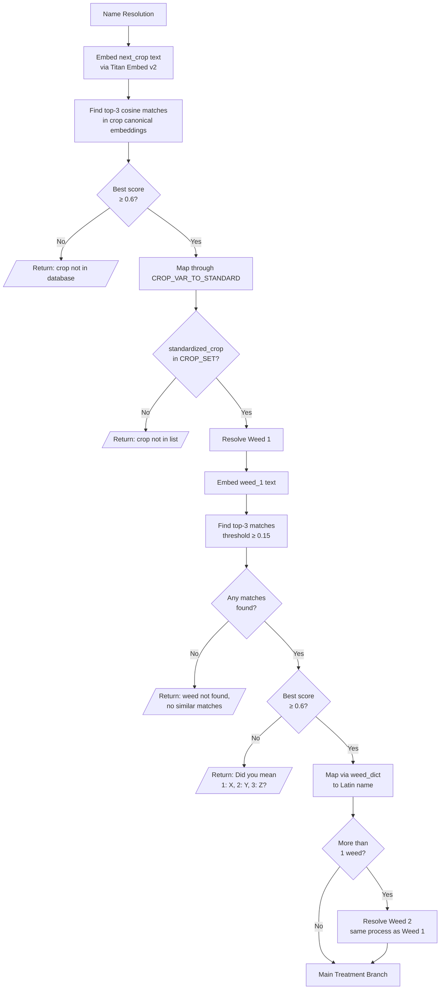
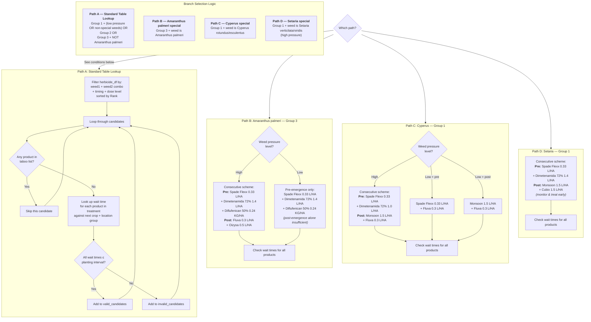
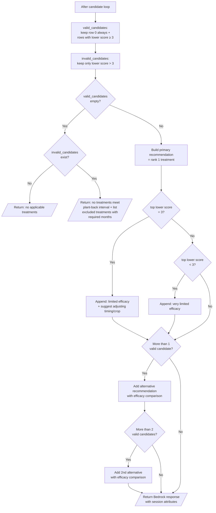
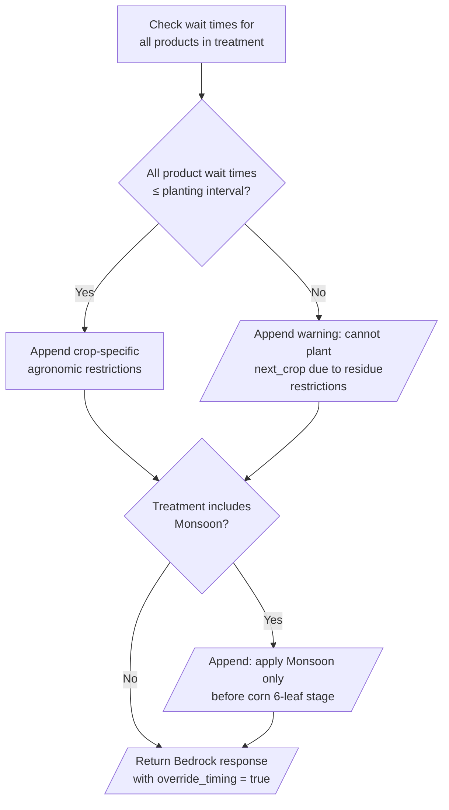

# Herbicide Recommendation Decision Flowchart

Open this file in a Mermaid-compatible viewer (GitHub, VS Code with Mermaid extension, mermaid.live, etc.)

## Full Decision Flow

## Dose Determination

## Name Resolution

## Main Treatment Branch

## Path A: Candidate Ranking & Response

## Paths B/C/D: Wait Time Validation

